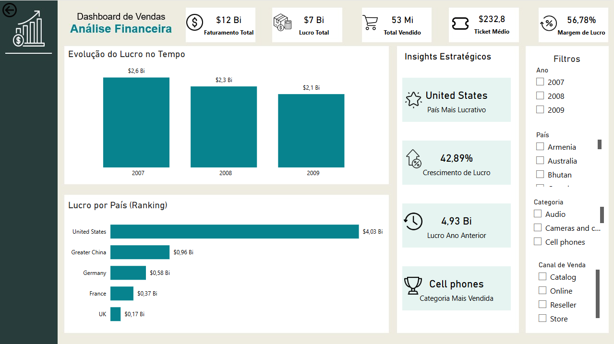

# Dashboard de Vendas - Análise Financeira (Contoso)

## 📌 Sobre o Projeto
Este projeto consiste em um dashboard executivo desenvolvido no Power BI integrado a um banco de dados SQL Server. O objetivo principal é analisar a evolução do lucro, faturamento e margens da empresa Contoso, além de identificar insights estratégicos automáticos como o país mais lucrativo e a categoria líder de vendas.

O grande diferencial deste projeto foi a **validação e tratamento prévio dos dados direto no banco de dados via SQL**, garantindo a qualidade da informação antes da etapa de visualização.

---

## 🛠️ Tecnologias Utilizadas
* **SQL Server / SSMS:** Criação da estrutura de views e scripts de validação de dados.
* **Power BI:** Modelagem de dados (Star Schema), desenvolvimento de fórmulas DAX e design de interface (UX/UI).

---

## 🖥️ Visualização do Dashboard

## 🗄️ Arquitetura e Desenvolvimento SQL

### 1. View de Análise Relacional (`01_criar_view_analise.sql`)
Construção de uma View unificando a tabela de Fatos (`FactSales`) com as tabelas de Dimensões (`DimProduct`, `DimDate`, `DimChannel`, `DimStore` e `DimSalesTerritory`), aplicando conceitos de modelagem dimensional de alto nível.
* **Cálculo de Lucro na Fonte:** Redução do processamento no Power BI calculando o lucro direto na query (`SalesAmount - TotalCost AS Profit`).
* **Relacionamento em Cadeia:** Agrupamento de categorias e subcategorias para permitir análises de drill-down.

### 2. Script de Validação e QA (`02_validacao_kpis.sql`)
Desenvolvimento de consultas utilizando variáveis (`DECLARE`), funções de agregação e ordenação avançada para extrair os resultados consolidados (Gabarito) direto no banco. Isso garantiu que as medidas criadas posteriormente no Power BI batessem 100% com a realidade dos dados armazenados.

---

## 📊 Estrutura de Medidas DAX
As métricas no Power BI foram organizadas de forma limpa em pastas de exibição:
* **KPIs Financeiros:** Faturamento Total, Lucro Total, Margem de Lucro e Ticket Médio.
* **KPIs Performance Temporal:** Medidas de inteligência de tempo para comparação anual (Ano Anterior e Crescimento % de Lucro).
* **KPIs de Ranking e Insights:** Descobrimento dinâmico do País Campeão e Categoria Líder.
